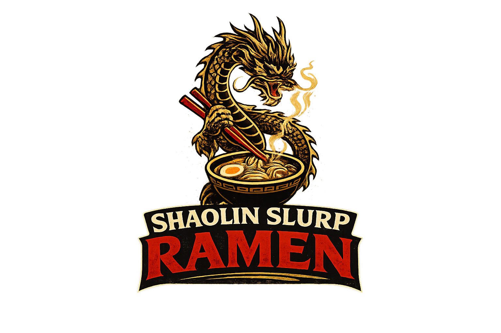

# Shaolin Slurp Ramen — Food Truck Website

https://wglewis0721.github.io/Shaolin-slurp/

Production-ready static website for the **Shaolin Slurp Ramen** food truck brand.
Built with pure HTML + CSS + minimal JS (no frameworks), designed for GitHub Pages hosting.

**Design:** Dark grindhouse aesthetic — matte black backgrounds, neon gold accents,
cinematic grain texture, bold kung-fu–inspired typography. Inspired by 70s–80s kung-fu
films, Wu-Tang street culture, and the discipline of the kitchen.

---

## Page Structure

| Section | ID | Purpose |
|---|---|---|
| Header / Nav | `#site-header` | Fixed sticky header with logo and primary nav links |
| Hero | `#hero` | Full-screen food truck background, neon dragon emblem, tagline, CTAs |
| About | `#about` | Two-column grid — chef portrait + brand origin story |
| Menu | `#menu` | Signature bowls, add-ons grid, and full menu poster graphic |
| Find the Truck | `#find-the-truck` | Social follow CTA with Instagram and TikTok links |
| Footer | *(`.site-footer`)* | Brand icon, tagline, social icons, dynamic copyright |

---

## Running Locally

No build step required. Simply open `index.html` in any modern browser:

```bash
# Option 1 — double-click
open index.html        # macOS
start index.html       # Windows

# Option 2 — local dev server (optional, avoids any CORS quirks)
npx serve .            # Node.js — installs serve temporarily
python -m http.server  # Python 3 — then visit http://localhost:8000
```

---

## Publishing to GitHub Pages

1. Push (or upload) this repository to GitHub.
2. Go to **Settings → Pages** in your repository.
3. Under **Branch**, select `main` (or `master`) and the root folder `/`.
4. Click **Save**.
5. GitHub will provide a URL like `https://yourusername.github.io/repo-name/` within a minute or two.

> **Tip:** Make sure `index.html` is in the root of the repository (it is, by default).

---

## Asset Setup

All images referenced in the site are organized inside the `/assets/` folder by subfolder.

| File path | Used in |
|---|---|
| `assets/backgrounds/shaolin-hero-food-truck-3840x2160.jpg` | Hero section full-screen background |
| `assets/backgrounds/shaolin-grindhouse-texture-2048.png` | Hero grain/grindhouse overlay |
| `assets/backgrounds/shaolin-ramen-closeup.jpg` | Find the Truck CTA section background |
| `assets/logo/shaolin-logo-primary.png` | Header logo |
| `assets/logo/shaolin-neon-dragon-emblem.png` | Hero section neon emblem |
| `assets/logo/shaolin-dragon-icon.png` | Favicon, CTA section icon, footer icon |
| `assets/about/shaolin-about-chef-portrait.jpg` | About section chef portrait |
| `assets/menu/shaolin-menu-background-1920.jpg` | Menu section background |
| `assets/menu/shaolin-menu-full-graphic.jpg` | Full menu poster graphic |
| `assets/social/shaolin-social-promo-1.jpg` | OpenGraph / Twitter Card social preview image |

### Replacing the Logo

To swap out the header logo or neon hero emblem, drop your new PNG files into
`assets/logo/` and update the corresponding `src` attributes in `index.html`:

```html
<!-- Header logo -->


<!-- Hero emblem -->

```

---

## Updating Social Links

The Instagram and TikTok links in the **Find the Truck** section and the footer
currently point to the generic homepages. Replace them with your real profile URLs.

Search `index.html` for these two `href` values and update both occurrences of each:

| Placeholder URL | Replace with |
|---|---|
| `https://www.instagram.com/` | Your Instagram profile URL |
| `https://www.tiktok.com/` | Your TikTok profile URL |

---

## Menu Items

The menu is written directly in `index.html` inside the `#menu` section.
To add, remove, or reprice bowls or add-ons, edit the corresponding `<li class="menu-item">` blocks.

To add a new bowl:

```html
<li class="menu-item">
  <div class="menu-item-header">
    <span class="menu-item-name">Your Bowl Name</span>
    <span class="menu-item-price">$14</span>
  </div>
  <p class="menu-item-desc">Description of the bowl and its ingredients.</p>
</li>
```

---

## Tech Stack

- **HTML5** — semantic, accessible markup
- **CSS3** — custom properties, grid, flexbox, responsive breakpoints, fade-in animations
- **Minimal JS** — sticky header, hero parallax, hamburger menu toggle, scroll-triggered animations, dynamic copyright year
- **Google Fonts** — Bebas Neue, Oswald, Inter
- No external frameworks, no build tools, no dependencies
- Hosting: **GitHub Pages** (static)

---

## Contact

Questions or updates? Reach out at **shaolinslurp@gmail.com**